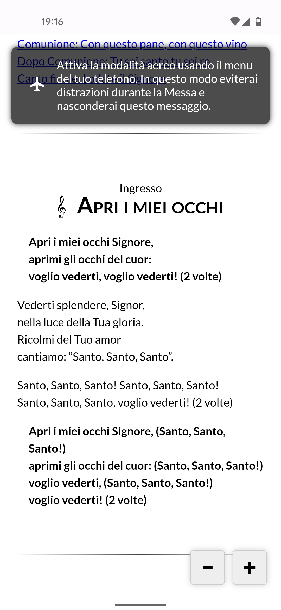

# Foglietto dei canti

Copyright (c), 2021 Ignazio Di Napoli
([neclepsio@gmail.com](mailto:neclepsio@gmail.com))

In seguito alla richiesta di come realizzare un "foglietto" per i canti sul
cellulare, ho realizzato questa pagina in modo che sia facile da modificare. 

Puoi vedere un esempio su [neclepsio.github.io/campitelli/canti.html](https://neclepsio.github.io/campitelli/canti.html).

Le principali caratteristiche di questo foglietto sono:
- il testo è facile da modificare, con un modo semplice di gestire gli stili;
- è possibile modificare lo zoom tramite pulsanti, usando due dita oppure con
  doppio tocco e trascinamento in alto o in basso;
- si possono inserire alcune semplici immagini predefinite;
- si possono inserire note che vengono visualizzate solo premendo sul relativo
  tasto;
- quando visualizzato su un telefono collegato ad internet, viene visualizzato
  un messaggio che invita a mettere in modalità aereo per evitare distrazioni
  durante la Messa;
- quando visualizzato su un computer con schermo orizzontale i canti vengono
  visualizzati su più colonne, in modo da poterlo usare per le proiezioni;
- si può inserire un link al video di ogni canto per permettere di impararlo
  prima della Messa.

Per preparare il tuo foglietto, copia tutti i file di questo repository e
segui le istruzioni all'interno del file `guida.txt`. Visualizza poi `canti.html`
nel browser.

Per pubblicare il risultato potresti, per esempio, usare [GitHub
Pages](https://pages.github.com/), che è gratuito ma ha l'interfaccia in 
inglese. Suggerisco anche di usare [Bitly](https://www.bitly.com) per accorciare 
l'indirizzo e comunicarlo più facilmente.

Non dimenticare di leggere la licenza.

Se decidi di usare questo foglietto, mandami una email a
([neclepsio@gmail.com](mailto:neclepsio@gmail.com)) e fammi sapere cosa ne
pensi.
